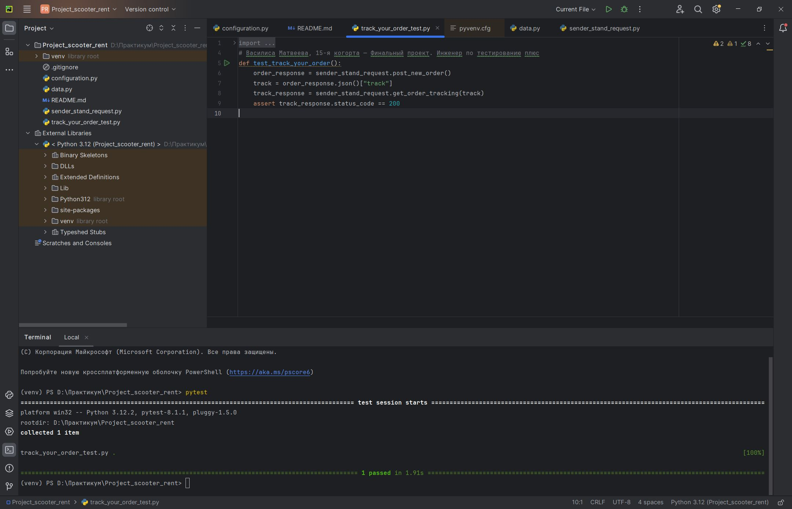

# Тест на проверку статуса при отслеживании созданного заказа в Яндекс.Самокат с помощью API Яндекс.Самокат.
- Для запуска тестов должны быть установлены пакеты pytest и requests
- Для запуска тестов необходимо в configuration изменить значение URL_SERVICE url на актуальный
- Запуск всех тестов выполняется командой pytest

# Скриншот выполнения теста


# SQL запросы
- ```
    SELECT "courierId", COUNT("inDelivery")
    FROM "Orders"
    WHERE "inDelivery" = true
    GROUP BY "courierId";
  ```
- ```
    SELECT track, cancelled, finished, "inDelivery",
    CASE WHEN cancelled = true THEN -1
    WHEN finished = true THEN 2
    WHEN "inDelivery" = true THEN 1
    ELSE 0 END
    FROM "Orders";
  ```